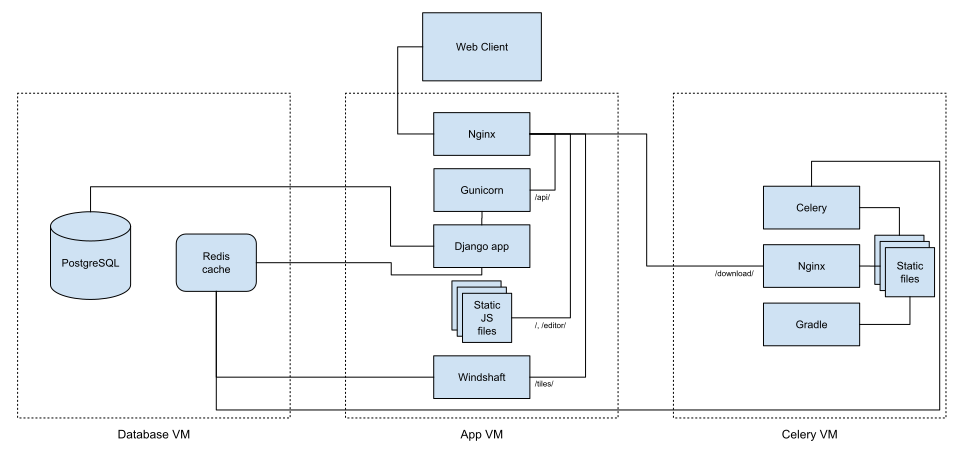
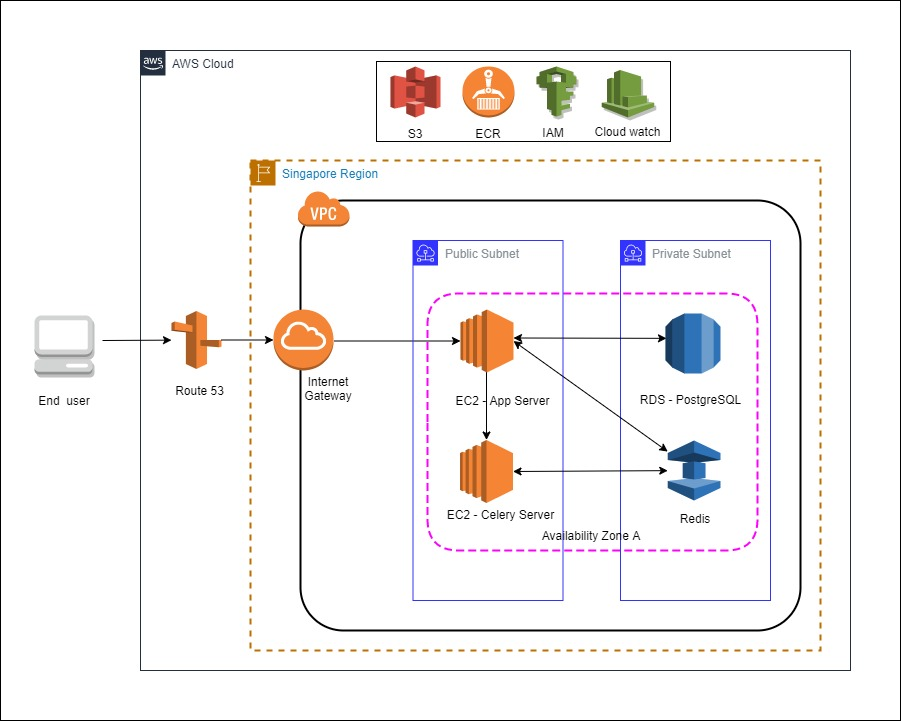
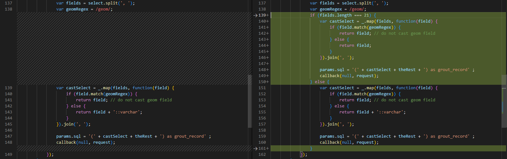

# System administration and troubleshooting

The goal of this document is to provide enough information to allow a system administrator to set up and maintain a production DRIVER system, and to aid in troubleshooting if something goes wrong.

These instructions are designed to be run on a Linux- or Unix-like system.


## Sections
- [**General system architecture**](#general-system-architecture)
- [**Driver application AWS Infrastructure**](#driver-application-aws-infrastructure)
- [**Deployment**](#deployment)
- [**Deploying updates**](#deploying-updates)
- [**Making custom changes**](#making-custom-changes)
- [**Using Monit to restart services**](#using-monit-to-restart-services)
- [**Logging into servers and viewing logs**](#logging-into-servers-and-viewing-logs)
- [**Firewall configuration**](#firewall-configuration) 
- [**SSL certificate configuration**](#ssl-certificate-configuration)
- [**Modified Windshaft configaration**](#modified-windshaft-configaration)
- [**Cleaning up after Docker**](#cleaning-up-after-docker)
- [**Docker file Host information**](#Docker-Image-Host-Information)
- [**Backup Policy**](#backup-policy-for-aws-services)
- [**General troubleshooting notes for server restarts**](#general-troubleshooting-notes-for-server-restarts)

## General system architecture

The default DRIVER production setup consists of three servers, all running Ubuntu 14.04 LTS:

1. Database host
   * [PostgreSQL](https://www.postgresql.org/) database for storing data
   * [Redis](http://redis.io/) service for caching temporary data
2. App host
   * [Django](https://www.djangoproject.com/) application backend
   * [Nginx](https://www.nginx.com/) web proxy for routing requests
   * [Gunicorn](http://gunicorn.org/) for interfacing between `Nginx` and `Django`
   * [Windshaft](https://github.com/CartoDB/Windshaft) for serving map tiles
3. Celery host
   * `Nginx` web proxy for serving file downloads
   * [Celery](http://www.celeryproject.org/) workers for processing asynchronous and batch requests
   * [Gradle](http://gradle.org/) service for Android JAR creation

Each of these servers also includes:
   * [Monit](https://mmonit.com/monit/) service for monitoring and restarting services
   * Firewall configuration via [ufw](https://help.ubuntu.com/community/UFW)
   * Logs for each locally running service, see [logging.md](logging.md) for details



## Driver application AWS Infrastructure:
For DRIVER Application used following services from AWS

1. Used two EC2 instances for application and Celery
2. Database hosted in AWS RDS 
3. Redis hosted in AWS elastiCache
4. All docker image are managed from AWS ECR
5. Domain(DNS) manage using AWS Route 53
6. Database daily backup store in S3



## Deployment
### 1. Initial setup

Using whatever computing resources are available to you, set up three blank servers running Ubuntu 14.04. Amazon Web Services (AWS) is the preferred way to set up these servers, but other cloud providers such as Microsoft Azure should work as well. If you have physical servers provided by your IT department, they will also work.

If you are using AWS, you can take advantage of the CloudFormation template file located at `deployment/updated_driver_cf_infra`. See **CloudFormation** below.

Make sure you have SSH access to the servers via an identity file before proceeding.
For example, if your servers are in AWS, you will need the `.pem` identity file that grants access. See [here](https://docs.aws.amazon.com/AWSEC2/latest/UserGuide/ec2-key-pairs.html) for instructions on creating this file for AWS.

For each server, note down:
1.	The public IP address used to access the server via SSH & the private IP of RDS & Redis to connect from app & celery instances.
2.	(If applicable) The server's private IP address. This is likely to apply if the server is running in a cloud provider such as AWS.

## Database server configuration (one time)

We will use RDS for the PostgreSQL database for an application, so we will skip all database-related steps & configuration of the DRIVER project. We will use a snapshot of RDS in CloudFormation which will have the required configuration of the database. As a result, when the CloudFormation yaml script will be run, the configured database server will be launched.

After launching postgresql(10) RDS, configure the database, user & permission. Connect with postgresql :

```
 psql \
   --host=IP \
   --port=5432 \
   --username=user \
   --password \
   --dbname=masterdb
```
```
CREATE ROLE driver WITH PASSWORD '<>' CREATEDB CREATEROLE LOGIN;
```
```
GRANT rds_superuser TO driver;
```

## Then login database again with driver user
```
create database driver;
create extension postgis; 
CREATE ROLE windshaft WITH PASSWORD '<>' CREATEDB CREATEROLE LOGIN;
GRANT rds_superuser TO windshaft;
CREATE ROLE heimdall WITH PASSWORD '<>’' CREATEDB CREATEROLE LOGIN;
GRANT rds_superuser TO heimdall;
Then login database again with heimdall user
create database lockspace;
```

Then  take a snapshot from RDS, use the ARN of the snapshot in cloudformation script to provision RDS everytime. So, we can say that database configuration will be done one time.


### CloudFormation
To launch the DRIVER instances in an AWS account, follow these steps:
1. Log into the AWS console and navigate to the CloudFormation service console.
2. Click `Create Stack`
3. Under `Choose a template`, select `Upload a template to Amazon S3` and choose `deployment/demo-cfn-template.yaml` under the project directory. Click `Next`.
4. On the `Specify Details` screen, fill in the requested parameters. In a production scenario with many users, we recommend using at least `t2.large` instances, but `t2.medium` instances will work fine if you are not anticipating a lot of user activity. For RDS and Redis you can select the `db.t3.medium` and `cache.t3.micro` depends on user activity. Enter `DBUsername`,`DBPassword` and `DBInstanceIdentifier` for database configure. For `KeyName`, enter the name of the key pair you created previously. For `NameSuffix`, enter a short name that will help you remember the purpose of the servers that will be launched. Click `Next`.
5. On the `Options` screen you should not need to make any changes. Click `Next`.
6. On the `Review` screen, review the parameters you have entered. If everything looks good, click `Create`.
7. Once your DRIVER instances have been launched, note down their public and private IP addresses and continue with the deployment process. You can find this information by clicking the `Resources` tab after the stack is up. You can then select an instance by its `Physical ID`. You can select an instance & RDS & Redis by its Physical ID. The public and private IPs will be shown under the "Description" tab at the bottom of the page of instances. For RDS & Redis  you will get an endpoint . By using the endpoint you will get private  IP of RDS & Redis.

### 2. DNS Setup

Determine the domain name at which you plan to make your DRIVER instance accessible (drspbd.org). Use your DNS management system to create an A record which that directs the DRIVER domain name to the IP address of server you plan to use as the **App** host (see above).

A domain name is necessary for DRIVER to function correctly. If you do not have a domain name available, you should follow the instructions in `README.md` to set up a local development instance of DRIVER, and use that until you can obtain a domain name.

### 3. Configuration files

When checking out the source code, make sure to checkout the tag that you want to deploy. The list of valid tags can be found [here](https://github.com/WorldBank-Transport/DRIVER/tags). To do this, run `git fetch --all && git checkout tags/<version>`.

In addition to the source code, there are three files not checked in to the repository that are needed in order to successfully deploy. These files are as follows:

1. Ansible group-vars (`deployment/ansible/group_vars/production`)
2. Ansible inventory (`deployment/ansible/inventory/production`)
3. Gradle Keystore (`gradle/data/driver.keystore`)

The Ansible **group-vars** and **inventory** should be generated by using the *configuration wizard* (see below).

The Gradle **keystore** always needs to exist, but if you don't want to use DRIVER's companion data entry app, you can use a blank file by running `touch gradle/data/driver.keystore`. If you *do* want to use the data-entry app, however, you will need to generate the file properly. More detailed instructions on how to generate this file are available in the [DRIVER-Android](https://github.com/WorldBank-Transport/DRIVER-Android) repository. You can always add this functionality later.

#### Configuration wizard

Run the setup wizard by executing `./scripts/generate_deployment_config`. This will prompt you for the domain name and IP addresses that you noted down previously. The script will then generate a barebones versions of the Ansible group-vars and inventory files for you, including auto-generated passwords. **You will still need to edit the group-vars**, but the wizard is a convenient way to get started.

Once you've run the wizard, open up `deployment/ansible/group_vars/production` using a text editor. The file contains numerous parameters that must be set correctly in order for your installation of DRIVER to function. It also contains explanations of the meaning of each parameter. The **configuration wizard** will have already set most of these values to reasonable defaults, so you shouldn't need to change many. However, there are some that you will almost certainly want to change:
- `app_version`: Set this to the `<version>` that corresponds to the tag you checked out in Step 3
- `driver_admin_email`: Set this to your email.
- `languages`: Change this to the language(s) you want to use.
- `local_time_zone_id`: Set this to the time zone of the area where you will use DRIVER.
- `local_country_code`: Set this to your country's two-letter code.
- `local_center_lat_lon`: Set this to the location where you want DRIVER's maps to be centered by default.

All database user’s password should be changed as per the database server configuration on RDS from `deployment/ansible/group_vars/production`

Redis IP need to bind `Redis_bind_address: “Redis private IP”` from  `deployment/ansible/inventory/production`

Don't worry about making a mistake here -- you can always change the parameters and re-run the deployment process (next section) if you realize you need to make changes later.

### 4. Deploy

There is a deployment server that should have required an environment preparation for ansible & python as per the requirement of application deployment.

OS-level requirements: 
`Python 2.7 (can be virtual ENV)`

Ansible version: `2.0.0.1`

Finally Activate the python 2.7 virtual environment using following command:
```
source <pyhton2.7 virtual env directory>/bin/activate
```

Once the **group-vars** and **inventory** files are in place, deployment may be performed by opening a terminal, switching to the directory of the DRIVER source code and running the following command (NOTE: Make sure to change the `--user` argument to a user that has sudo privileges on those servers):
```
ansible-playbook -i deployment/ansible/inventory/production --user=ubuntu --key-file <file_name.pem> \
    deployment/ansible/app.yml 
```
```
ansible-playbook -i deployment/ansible/inventory/production --user=ubuntu --key-file <file_name.pem> \
    deployment/ansible/celery.yml
```

When running this command, you may see messages of the form `The authenticity of host '...' can't be established`. If so, type `yes` and hit Enter. You may have to do this several times before provisioning will begin. If you nonetheless receive an error like `fatal: [app]: UNREACHABLE! =>{"changed": false, "msg": "Failed to connect to the host via ssh: Host key verification failed.`, just re-run the command.

The following are links to the `Ansible` documentation for an in-depth description of how to use inventories and variables:
 * [Ansible inventory documentation](http://docs.ansible.com/ansible/intro_inventory.html)
 * [Ansible variables documentation](http://docs.ansible.com/ansible/playbooks_variables.html)

## Deploying updates

To deploy updates or make changes to the application, follow these steps:
1. Edit `deployment/ansible/group_vars/production` with your desired changes.
2. If you changed the `app_version` parameter, run `git fetch --all && git checkout tags/<version>` where `<version>` should be the same as the version number you set in `app_version`.
3. Re-run the `ansible-playbook` command from the previous section.

## Making custom changes
The code for DRIVER is open-source, which makes it possible for any software developer to alter the software's functionality, fix bugs, and add features.

If you have software development resources available to make these types of changes, you are encouraged to [submit pull requests](https://github.com/WorldBank-Transport/DRIVER/pulls) to the DRIVER repository so that all DRIVER users can benefit.

However, if you want to deploy your changes to your production version of DRIVER before they are incorporated into the main repository, you will need to maintain your own Docker registry that your copy of DRIVER can use to install your custom code.

Setting up a Docker registry is beyond the scope of this document; there are various services, such as [AWS Elastic Container Registry](https://aws.amazon.com/ecr/) and [Quay](https://quay.io/), which can be used to operate a registry, and you can use their documentation to get a registry set up.

Once you have a Docker registry set up, follow these steps to use it when deploying your copy of DRIVER:
1. Execute `vagrant up && vagrant ssh celery`
2. Build images for the following 5 containers:
   - App: `sudo docker build -f opt/app/Dockerfile.base -t "<your-repository>/driver-app" /opt/app`
   - Schema Editor: `sudo docker build -f /opt/schema_editor/Dockerfile -t "<your-repository>/driver-editor" /opt/schema_editor`
   - User interface: `sudo docker build -f /opt/web/Dockerfile -t "<your-repository>/driver-web" /opt/web`
   - Gradle: `sudo docker build -f /opt/gradle/Dockerfile -t "<your-repository>/driver-gradle" /opt/gradle`
   - Analysis tools: `sudo docker build -f /opt/analysis_tasks/Dockerfile -t "<your-repository>/driver-analysis" /opt/analysis_tasks`
3. Push images for all containers:
   - `docker push "<your-repository>/driver-app:latest"`
   - `docker push "<your-repository>/driver-editor:latest"`
   - `docker push "<your-repository>/driver-web:latest"`
   - `docker push "<your-repository>/driver-gradle:latest"`
   - `docker push "<your-repository>/driver-analysis:latest"`
4. Then, edit your `deployment/ansible/group_vars/production` file and change the `docker_repository` parameter to point to your repository.
5. Redeploy your stack as usual, following the deployment instructions above.

## Using Monit to restart services

`Monit` has an easy to use web interface for monitoring and managing the services on each machine. It may be accessed by browsing to `http://<IP_OF_THE_SERVER>:2812` and entering the supplied administrator username and password. For security reasons, the web interface is only accessible by users with IPs configured in the `monit_allow_hosts` section of the `production` group_vars file. If an administrator needs access to this interface, their IP must be added to this list.

Once logged into the interface, it is possible to see the overall status of the server via statistics on CPU, Memory, and Swap usage. There are also line items for each relevant service running. A status of `Status ok` or `Running` indicates the service is healthy. Other status messages (such as `Not monitored`) will be displayed when there is a problem. In such a scenario, it's possible to restart the service from the `Monit` interface by clicking on the name of the service to enter the service details mode, and then clicking `Start service`. None of the services listed within the `Monit` interface are optional. They are all required for the DRIVER system to be fully functional, so anything that's not listed as healthy needs to be restarted.


## Logging into servers and viewing logs

`Monit` should be the first line of troubleshooting, due to its ease of use in quickly diagnosing an issue and restarting a failed service, however it may occasionally be necessary to log into the servers themselves in order to fix a problem. For example, if after restarting a failed service via `Monit`, it fails to become healthy. In such a scenario, the individual servers may be logged into via the command:
`ssh -i <location of ssh identify file> <username>@<server IP>`

Once logged into the desired server, the log files may be examined by using `tail`, `nano`, `vim`, or any other desired method of viewing log content. See [logging.md](logging.md) for detailed information of where specific log files are located. Examination of the log files will most likely lead to the underlying problem which will need to be fixed. Once the problem has been fixed, the failing service may be restarted by either using `Monit`, as described above, or by restarting the service manually via the `service` command. For example, restarting `nginx` can be done by executing the command: `sudo service nginx restart`. Many of the custom services running in `DRIVER` start with the `driver-` prefix, and can be found by running the command `initctl list | grep driver`. If after that command is run, the web application (`driver-app`) is shown as stopped, and needs to be restarted, the command to do so would be: `sudo service driver-app restart`.


## Firewall configuration

All service are hosted in AWS. We are using cutom define `VPC` and `security group` from AWS. RDS and Redis are hosted in private subnet. So any one canot access from public internet. For App and Celery instance allow some specific port from security group. Each server has firewall rules applied which limit access by IPs and ports. The current firewall configuration can be viewed by running the command `sudo ufw status`. If any server IPs are modified, the firewall rules will need to be updated as well. This may be done manually via `ufw` commands, but the best way to accomplish this is probably updating the firewall IP address configuration in the `production` group_vars file and running the deployment script. The current firewall rules are applied for both `ufw` and `security group`as follows:

 * App host - http & http[s] is allowed
 * Celery host - http & http[s] is allowed only from App host servers (e.g. for CSV downloads)
 * Database host - PostgreSQL allowed from App and Celery hosts.
 * Redis host - Redis connections are allowed from App and Celery hosts.
 * SSH is allowed from App and Celery instance.
 * monit service port allow from App and Celery.
 * Everything else is blocked.

In order to diagnose issues with the firewall, it may be necessary to disable it temporarily. This may be done with the command: `sudo ufw disable`. And it may be re-enabled with the command `sudo ufw enable`.

## SSL certificate configuration

The web server is configured with an SSL certificate which has been automatically obtained from the `driver.nginx/tasks` folder(but for this there should be the `crt` & `key file`). This certificate is valid for a period of 365 days, at which point a new SSL certificate must be obtained. This SSL is purchased from Namecheap against the drspbd.org domain. Before expiration, SSL should be renewed by payment on Namecheap & then use renewed SSL by replacing the previous one.

### Modification & Changes on the script of Nginx: 
We are disable “- { role: "driver.letsencrypt", when: staging or production }” from `deployment/ansible/roles/driver.nginx/meta/main.yml` by commenting out as we are not using lets-encrypt ssl for our app.

SSL certificate purchase from namecheap. store the certificate file (filename.crt) to the “deployment/ansible/roles/driver.nginx/tasks/” location.

update `deployment/ansible/roles/driver.nginx/tasks/main.yml` file as like as below:
```
---
- name: create ssl directory  
  file:
    path: /etc/nginx/ssl
    state: directory
    
- name: copying crt file of ssl
  #  become: true 
  copy:
    src: drspbd.org.crt
    dest: /etc/nginx/ssl/drspbd.org.crt

- name: copying key file of ssl
  #  become: true 
  copy:
    src: drspbd.org.key
    dest: /etc/nginx/ssl/drspbd.org.key

- name: Configure Nginx site
  template: src=nginx-app.conf.j2
            dest=/etc/nginx/sites-available/driver-app.conf
  notify:
    - Restart Nginx

- name: Enable Nginx site
  file: src=/etc/nginx/sites-available/driver-app.conf
        dest=/etc/nginx/sites-enabled/driver-app
        state=link
  notify:
    - Restart Nginx

- name: Configure Nginx log format
  template: src=log-format.conf.j2
            dest=/etc/nginx/conf.d/log-format.conf
  notify:
    - Restart Nginx

- name: Set up monit monitoring of nginx for app
  template: src=monit-nginx-app.cfg.j2 dest=/etc/monit/conf.d/driver-app-nginx.cfg
  notify:
    - Restart monit
```

## Updated nginx-app.conf.j2

Now need to update Nginx configaration from `deployment/ansible/roles/driver.nginx/templates/`

```
server {


    ssl on;
    listen 443 default_server ssl;
   ssl_certificate /etc/nginx/ssl/drspbd.org.crt;
   ssl_certificate_key /etc/nginx/ssl/drspbd.org.key;

   listen 80 default_server;


    server_name {{ nginx_server_name }};
    root {{ web_build_dir }};
    index index.html;

    access_log /var/log/nginx/driver-app.access.log logstash_json;

    client_max_body_size 10m;

    location / {
        proxy_set_header   Host $http_host;
        proxy_set_header   X-Forwarded-Host $host;
        proxy_set_header   X-Forwarded-Server $host;
        proxy_set_header   X-Real-IP        $remote_addr;
        proxy_set_header   X-Forwarded-For  $proxy_add_x_forwarded_for;
        proxy_set_header   Authorization $http_authorization;
        proxy_pass_header  Authorization;

        try_files $uri $uri/ =404;
    }

    location /editor/ {
        alias {{ editor_build_dir }}/;

        proxy_set_header   Host $http_host;
        proxy_set_header   X-Forwarded-Host $host;
        proxy_set_header   X-Forwarded-Server $host;
        proxy_set_header   X-Real-IP        $remote_addr;
        proxy_set_header   X-Forwarded-For  $proxy_add_x_forwarded_for;
        proxy_set_header   Authorization $http_authorization;
        proxy_pass_header  Authorization;

        try_files $uri $uri/ =404;
    }

    location /api/ {
        proxy_pass http://localhost:4000;
        proxy_read_timeout 40s;
        proxy_redirect     off;
        proxy_set_header   Host $http_host;
        proxy_set_header   X-Forwarded-Host $host;
        proxy_set_header   X-Forwarded-Server $host;
        proxy_set_header   X-Real-IP        $remote_addr;
        proxy_set_header   X-Forwarded-For  $proxy_add_x_forwarded_for;
        client_max_body_size 20M;
    }

    location /admin/ {
        proxy_pass http://localhost:4000;
        proxy_read_timeout 40s;
        proxy_redirect     off;
        proxy_set_header   Host $http_host;
        proxy_set_header   X-Forwarded-Host $host;
        proxy_set_header   X-Forwarded-Server $host;
        proxy_set_header   X-Real-IP        $remote_addr;
        proxy_set_header   X-Forwarded-For  $proxy_add_x_forwarded_for;
    }

    location /api-auth/ {
        proxy_pass http://localhost:4000;
        proxy_read_timeout 40s;
        proxy_redirect     off;
        proxy_set_header   Host $http_host;
        proxy_set_header   X-Forwarded-Host $host;
        proxy_set_header   X-Forwarded-Server $host;
        proxy_set_header   X-Real-IP        $remote_addr;
        proxy_set_header   X-Forwarded-For  $proxy_add_x_forwarded_for;
        proxy_set_header   Authorization $http_authorization;
        proxy_pass_header  Authorization;

    }

    location /api-token-auth/ {
        proxy_pass http://localhost:4000;
        proxy_read_timeout 40s;
        proxy_redirect     off;
        proxy_set_header   Host $http_host;
        proxy_set_header   X-Forwarded-Host $host;
        proxy_set_header   X-Forwarded-Server $host;
        proxy_set_header   X-Real-IP        $remote_addr;
        proxy_set_header   X-Forwarded-For  $proxy_add_x_forwarded_for;
        proxy_set_header   Authorization $http_authorization;
        proxy_pass_header  Authorization;

    }

    location /openid/ {
        proxy_set_header Host $http_host;
        proxy_pass http://localhost:4000;
        proxy_read_timeout 40s;
        proxy_redirect     off;
        proxy_set_header   X-Real-IP        $remote_addr;
        proxy_set_header   X-Forwarded-For  $proxy_add_x_forwarded_for;
    }

    location /static/ {
        root {{ root_www_dir }}/;
    }

    location /media/ {
        root {{ root_www_dir }}/;
    }

    location /download/ {
        proxy_pass http://{{ celery_host_address }}/;
        proxy_read_timeout 40s;
        proxy_redirect     off;
        proxy_set_header   Host $http_host;
        proxy_set_header   X-Forwarded-Host $host;
        proxy_set_header   X-Forwarded-Server $host;
        proxy_set_header   X-Real-IP        $remote_addr;
        proxy_set_header   X-Forwarded-For  $proxy_add_x_forwarded_for;
    }

    location /tiles/ {
        proxy_pass http://localhost:5000;
        proxy_read_timeout 40s;
        proxy_redirect     off;
        proxy_set_header   Host $http_host;
        proxy_set_header   X-Forwarded-Host $host;
        proxy_set_header   X-Forwarded-Server $host;
        proxy_set_header   X-Real-IP        $remote_addr;
        proxy_set_header   X-Forwarded-For  $proxy_add_x_forwarded_for;
    }
}


server {
    listen 80;
    server_name _;

    # Redirect all other http traffic to https
    location / {
       return 301 https://$host$request_uri;
    }
}

```
### Note:

If you want to browse like https://domain_name/editor instead of https://domain_name/editor/ (its default in DRIVER) then just remove  last “/” from  “location /editor/” in nginx-app.conf.j2

## Cleaning up after Docker

[Docker](https://www.docker.com/) is used in several places with the DRIVER system to keep services separated out and running in their own containers. `Docker` keeps around old cached layers, which take up a lot of disk space. If the disk is getting low, it may be helpful to clear this cache. This can be done by executing the commands:
```
sudo su -
docker images --no-trunc| grep none | awk '{print $3}' | xargs -r docker rmi
```

This is helpful as a short-term workaround for clearing up some disk space, but if it is encountered, it probably means it's a good time to allocate more space to the disk.

## Docker Image Host information

We are using `AWS ECR` for docker image host. When it deployment to the server using ansible. pull docker from AWS ECR and deployment to the App and Celery server. following docker image are hosted in ECR:
```
driver-analysis
driver-app
driver-editor
driver-gradle
driver-web
```
All docker are successfully build and push to AWS ECR. But we facing some build issue for `driver-app` image. Some package is not supported to build. new packages added to the dockerfile instead with previous packages. we fixed the issue and uploaded `driver-app` image to the AWS ECR. following changes updated in `dockerfile.base` file-
```
Add “[trusted=yes]” in the given below line as it is shown - 

RUN echo "deb [trusted=yes] http://deb.debian.org/debian jessie main contrib non-free " > /etc/apt/sources.list.d/jessie.list

Comment in the given below line using -
#RUN pip install --no-cache-dir  djsonb  -r requirements.txt
 
Add some command line there to install required packages-  

RUN pip install rsa==3.4.2
RUN pip install --upgrade pip
RUN pip install --no-cache-dir -r requirements.txt djsonb
RUN pip install --no-cache-dir djsonb
```


## Modified Windshaft configaration: 
There are some modifications happened to fix syntax error of postgis

The file location : `winshaft/driver.js`
```
                var castSelect = _.map(fields, function(field) {
                    if (field.match(geomRegex)) {
                        return field; // do not cast geom field
                    } else {
                        return field + '::varchar';
                    }
```
Above code part will be replaced by given below code

```
if (fields.length === 21) {
                    var castSelect = _.map(fields, function(field) {
                        if (field.match(geomRegex)) {
                            return field; // do not cast geom field
                        } else {
                            return field;
                        }
                    }).join(', ');

                    params.sql = '(' + castSelect + theRest + ') as grout_record' ;
                    callback(null, request);
                } else {
                    var castSelect = _.map(fields, function(field) {
                        if (field.match(geomRegex)) {
                            return field; // do not cast geom field
                        } else {
                            return field + '::varchar';
                        }
                    }).join(', ');

                    params.sql = '(' + castSelect + theRest + ') as grout_record' ;
                    callback(null, request);
                }
```



## Web (frontend side)

1. One required dependency will be changed in the bower.json file as that one is deprecated.

Previous one:
    `"angular-file-saver": "1.0.3"`

Updated one:
    `"angular-file-saver": "elquimeras/ng-file-saver#^1.1.4"`


2. Following code changes are required for for UI. 

File location - `DRIVER/web/app/i18n/`

From `bn` file added following information- 
```
    "WEATHER": {
        "EMPTY": "",
        "FAIR": "ভাল",
        "RAIN": "বৃষ্টি",
        "WIND": "ঝড়",
        "FOG": "কুয়াশা",
        "DAY":"দিন",
        "DAWN_DUSK":"ভোর/সন্ধ্যা",
        "NIGHT_LIT":"আলোকিত সড়ক (রাতে)",
        "NIGHT_UNLIT":"অনালোকিত সড়ক (রাতে)"
    },
```
From `en-us` file added following information-
```
    "WEATHER": {
        "EMPTY": "",
        "FAIR": "Fair",
        "RAIN": "Rain",
        "WIND": "Wind",
        "FOG": "Fog",
        "DAY":"Day",
        "DAWN_DUSK":"Dawn/Dusk",
        "NIGHT_LIT":"Night (lit)",
        "NIGHT_UNLIT":"Night (unlit)"
    },
```
From `exclaim` file added following information-
```
    "WEATHER": {
        "EMPTY": "",
        "FAIR": "!Fair",
        "RAIN": "!Rain",
        "WIND": "!Wind",
        "FOG": "!Fog",
        "DAY":"!Day",
        "DAWN_DUSK":"!Dawn/Dusk",
        "NIGHT_LIT":"!Night (lit)",
        "NIGHT_UNLIT":"!Night (unlit)"
    },
```

From `Weather-service` file added following information-
```
(function () {
    'use strict';

    function WeatherService() {
        return {
            lightValues: [
                '',
                'Day',
                'Dawn_dusk',
                'Night_lit',
                'Night_unlit'
            ],
            weatherValues: [
                '',
		'Fair',
		'Rain',
		'Wind',
		'Fog'
            ]
        };
    }

    angular.module('driver.weather')
    .factory('WeatherService', WeatherService);
})();
```
## Backup policy for AWS Services

### EC2 Instance Backup:
Application hosted in EC2 instance; many services are running. So, we are prepared a backup plan for both App and Celery EC2 instances. We used `Lifecycle manager` for automatic snapshot creation for both instances with 2 days retention time. `Lifecycle manager` will be worked for only EC2 instances. Created a policy in `lifecycle manager` using Cloudformation script. In policy mention the snapshot creation time (UTC time). 

### Redis Backup policy:
We used Redis managed service from `AWS ElatiCache`. AWS provides automatic backup on daily basis with a specific retention time. We have created automatic backup plan with 2 days retention time. Automatic backup enables using cloudformation yaml script.

### RDS (Database) Backup policy:
We used RDS for the application database. AWS provides an automated backup plan with 5 minutes of retention time. The database can restore Using `restore point in time`. Enabled daily `snapshot` with 7 days retention time. Backup services are enabled using Cloudformation yaml script.

We are prepared `bash script` for DB backup from RDS. Daily the script will run using cronjob from application instance. Dump the database from RDS and store to the S3. DB dump file will store for 30 days. S3 is not publicly accessable. It can be restore to RDS using postgres client. 
```
#!/bin/bash
date=$(date +%Y-%m-%d_%H-%M-%S)
s3_bucket="driver-db-backup"

PGPASSWORD=xxxxxxxxxxx pg_dump -h driver.c7zp3bgas4zd.ap-southeast-1.rds.amazonaws.com -p 5432 -U driver driver > /tmp/$rds_dbname-$date.sql
aws s3 cp /tmp/$rds_dbname-$date.sql s3://$s3_bucket/$rds_dbname-$date.sql 
rm /tmp/$rds_dbname-$date.sql
aws s3 ls s3://$s3_bucket/$s3_path/ --recursive | grep $rds_dbname | awk '{print $4" "$5}' | while read line; do filedate=$(date -d "$(echo $line | awk '{print $1}')" +%s); if (( $(date +%s) - $filedate > 2592000 )); then aws s3 rm s3://$s3_bucket/$s3_path/$(echo $line | awk '{print $2}') ; fi; done5
```
## General troubleshooting notes for server restarts

There are a couple different ways in which the DRIVER system has been deployed. The preferred way to deploy the system is within Amazon Web Services (AWS), however it may also be deployed within a local server cluster. When using AWS, the machines are generally more reliable, and won't suffer from any amount of sporadic downtime.

AWS also has the concept of Security Groups, which allows the administrator to easily configure fine-grained access control rules. For example, the Database and Celery machines are typically set up to restrict port-specific traffic to only the App machine. This means that services such as PostgreSQL and Redis cannot be publicly accessed.

In an environment without Security Groups, a firewall must be configured on each machine to allow such restrictions. The firewall that comes configured with DRIVER by default is called UFW. The following is a set of general troubleshooting steps that may be performed when the servers are rebooted and the application no longer seems to behaving properly.


### 1. Ensure UFW is running

The firewall needs to be running on each of the three machines. Log in to each of the servers and run the command:
```
sudo ufw status
```
This should return a Status of `active`. If that's not the case, it can be activated with:
```
sudo ufw enable
```


### 2. Ensure driver-app is running

Run the following command on the App machine to see the status of `driver-app`:
```
service driver-app status
```
This should return a status of `start/running`. If it is instead `stop/waiting`, start it with the command:
```
service driver-app restart
```
Then check the status again to ensure it comes up. If there are any problems here, the log file (`/var/log/upstart/driver-app.log`) may be opened to do allow further debugging. One common source of errors here is related to Docker not being able to start up properly. If this is the case, there will be a log message such as:
```
docker: Error response from daemon: failed to create endpoint driver-app on network bridge: iptables failed: iptables --wait -t filter -A DOCKER ! -i docker0 -o docker0 -p tcp -d 172.17.0.2 --dport 4000 -j ACCEPT: iptables: No chain/target/match by that name.
```
Restarting Docker can be performed by running:
```
service docker restart
```
After Docker is running, `driver-app` will then need to be restarted again.

If at any point in the process, there are Redis errors within the log, it may be necessary to restart Redis first (see the following step for instructions).


### 3. Ensure Celery is running

Celery is responsible for running all asynchronous tasks within the application. This includes CSV exports, as well as running black spot calculations. To check if Celery is running, log into the Celery machine, and run the following command:
```
service driver-celery status
```
Also check the log at `/var/log/upstart/driver-celery.log`. If there are any errors related to Docker, perform the same instructions related to restarting Docker from the `driver-app` step above, and then restart Celery with:

```
service driver-celery restart
```


### 4. Verify the application is functioning

All services should now be running, reporting valid status, and showing good log messages: UFW and Docker are running on each machine, `driver-app` is running on the App machine, `driver-celery` is running on the Celery machine, and Redis is running on the Database machine.

Log into the web application, view the Dashboard, the Record List page, and the Map page to ensure records are displaying properly in each of the pages. Then attempt to perform a CSV export on the Map page. If it completes successfully, then the app is back in a functional state. If it times out, log into the Celery machine to see if jobs are processing. Follow the log file with:
```
tail -f /var/log/upstart/driver-celery.log
```
Hopefully there are some jobs processing, demonstrated by recent log messages such as:
```
[2019-04-29 23:37:33,329: INFO/MainProcess] Task data.tasks.export_csv.export_csv[e2362482-d2e4-4e99-b9b7-a91139081026] succeeded in 18.213758655s: 'Incidents-fb7a618b.zip'
```
Depending on how long the application has been down for, there may be a backlog of jobs for the system to churn through. Wait until the amount of processing tasks depletes, and then try another CSV export. It should now succeed.

If the log file is showing errors, consult the above steps, and check to make sure all of the required services are running, are returning good statuses, and there are no errors in any of the mentioned log files.


